# ChessSchool — Master Development Plan

> **Status:** Approved implementation roadmap  
> **Version:** 1.8  
> **Date:** 2026-07-09 (revised — branch-per-milestone, commit-only main, full verify gates)  
> **Authority:** Single source of truth for ChessSchool development execution  
> **Supersedes:** Ad-hoc wave planning in `README.md`; does not supersede `CLAUDE.md` operational runbook (which this plan will drive updates to)

---

# Executive Summary

ChessSchool is a **school-first chess academy** — a premium, offline-capable PWA (and companion native app) where students graduate through Classes → Semesters → Stages via FEN-verified lessons, exams, homework, and matches. Live at [chess-school.in](https://chess-school.in); repo `Shailesh200/ChessSchool`.

This Master Development Plan converts existing product documentation (`README.md`, `CLAUDE.md`, `CODE_REVIEW.md`, mobile parity docs) into a **milestone-driven, dependency-ordered implementation roadmap** from foundation through GA and long-term evolution.

**Technology stack (finalized — do not change without ADR):**

| Layer | Choice |
|-------|--------|
| Web | Next.js 16 (App Router, Turbopack) + React 19 + Tailwind v4 (`@theme` in CSS) |
| Mobile | Expo SDK 54 + Expo Router 6 + React Native 0.81 |
| State | Zustand (persisted, `skipHydration`) · mobile: `useSyncExternalStore` + context |
| Database | Drizzle ORM + libSQL (`@libsql/client`) — local SQLite file or Turso edge |
| Chess | chess.js · react-chessboard v5 (web) · custom SVG board (mobile) |
| Engine | Stockfish-18 WASM in Web Worker (web) · JS bot + native Stockfish scaffold (mobile branch) |
| Auth | bcryptjs + DB sessions + httpOnly cookies (web) · Bearer token + SecureStore (mobile) |
| Realtime PvP | Ably (optional) + adaptive polling fallback |
| Monorepo | pnpm workspaces + Turborepo *(planned → Bun — see M-076)* |
| Lint / Format / Hooks | ESLint + Prettier *(planned → Oxlint + Oxfmt + Lefthook — M-076)* |
| Deploy | Vercel (`apps/web` root) + Turso · EAS for mobile (not store-published yet) |
| Testing | Vitest (unit) · Playwright e2e (web, system Chrome) |

**Launch strategy (approved):** **Web GA first.** The native app store track (M-049–M-053) runs **after** public web launch — mobile remains supported via the live API but is not a launch blocker.

**Critical sequencing insight:** ChessSchool is a **curriculum-driven learning platform**. **Content must exist and be FEN-validated before progression, exams, and sync can be trusted.** Production hardening (M-043–M-048) is mandatory first. **Before Web GA**, gates must pass: **curriculum depth (M-063)**, **approved UI design (M-075 Phase A)**, **browser + PWA surfaces (M-059, M-010)**, **UI implementation (M-075 Phase B)**, and **launch readiness (M-070–M-073)**. See **G-WebGA** below.

**Total milestones:** 78 (M-001 through M-078)  
**Estimated duration to Web GA:** 3–6 months from M-043; mobile store + scale/toolchain follow

---

# Web GA Definition (approved)

**Web GA** = ChessSchool is ready for **public promotion** as a **web product** accessible in two modes:

| Surface | Milestone | Status | Requirement |
|---------|-----------|--------|-------------|
| **PWA** | M-010 | **Verified** | Installable, offline-capable, service worker, install prompt — already shipped |
| **Browser** | M-059 | **Verified** | Desktop sidebar + responsive layouts @390–1280 (owner approved 2026-07-10) |
| **Polish** | M-075 | **Verified** | Phase A ✅ · Phase B slices 1–4 ✅ (owner approved 2026-07-10) |
| **Content** | M-063 | **Verified** | Puzzle School bank + school-themed lessons |
| **Trust** | M-043–M-048, M-070 | M-043–M-048 **Verified** · **M-070 Verified** (2026-07-12) | Security, data integrity, privacy audit |
| **Launch** | M-073 | Not Started | Runbook, marketing pages, go-live checklist |

**Web GA is not** the native App Store release (that is **G-Mobile**, M-049–M-053, after M-073).

**Web GA is not** “mobile viewport only in Chrome.” Browser view means responsive layouts from ~320px phone through ≥1280px desktop, with sensible use of horizontal space (multi-column campus, wider lesson layout, desktop nav patterns where appropriate).

---

# Project Progress

| Metric | Value |
|--------|-------|
| **Overall Progress** | ~80% (product surface) · ~85% (Web GA ready) |
| **Current Phase** | Web GA final gates |
| **Current Milestone** | M-073 — Web GA Launch Readiness |
| **Completed Milestones** | M-001–M-048 (Verified) · M-056 · M-057 · M-059 · M-063 · M-064 · M-070 · M-071 · M-072 · M-075 Phase A/B (Verified) · G-Hardening complete |
| **In Progress** | — |
| **Blocked** | — |
| **Next Milestone** | M-073 — Web GA Launch Readiness |
| **Last Updated** | 2026-07-16 (v2.13 — M-072 Verified) |
| **Overall Completion %** | ~80% product · ~85% Web GA ready |

> Update this section as milestones are completed and verified.

---

# Planning Philosophy

## What This Plan Is

- A **milestone-driven engineering execution plan** for ChessSchool web + mobile + shared packages
- A **dependency graph** covering foundation → curriculum → accounts → cross-surface sync → mobile ship → GA
- The **permanent implementation roadmap** referenced by all future development

## What This Plan Is Not

- Not a Scrum backlog or Jira export
- Not a content-authoring schedule (curriculum expansion is tracked but not line-itemed lesson-by-lesson)
- Not a redesign of ChessSchool's product vision

## Milestone Execution Model

```text
Create milestone branch from main
      ↓
   Develop (commits on branch only)
      ↓
    Verify
      ↓
  Fix Issues
      ↓
 Owner approves → merge to main
      ↓
Next milestone branch from main
```

- **No fixed sprint durations** — milestones complete when verified
- **Deployable after every milestone merge** — monorepo remains buildable; web deployable to Vercel
- **Verify before advance** — Definition of Done must pass before merge and before the next branch opens

## Source Documents

| Document | Role in This Plan |
|----------|-------------------|
| `CLAUDE.md` | Operational runbook, stack, DB commands, deploy |
| `README.md` | Historical waves, feature inventory, deferred systems |
| `CODE_REVIEW.md` | Production-readiness audit (security, data integrity) |
| `apps/mobile/PLAN.md` | Mobile parity strategy (tokens, overlay-diff, phases) |
| `apps/mobile/PARITY_GAPS.md` | Current mobile backlog (authoritative; `PARITY.md` retired M-071) |
| `apps/mobile/RELEASE.md` | EAS build, OTA, store submission |
| `apps/mobile/STOCKFISH.md` | Native engine integration |
| `AGENTS.md` | Next.js 16 agent rules |

> See **Development Rules** and **Milestone Completion Protocol** for mandatory execution workflow.

---

# Development Rules

This section defines how development must proceed throughout the ChessSchool lifecycle. These rules are **mandatory** for all implementation work — human or AI-assisted.

## Core Discipline

1. **One active milestone at a time.** Only one milestone may be actively implemented at a time. Do not parallelize milestones that share unverified dependencies.
2. **One milestone = one branch.** All milestone work is committed on a dedicated `milestone/M-XXX-*` branch — **never directly on `main`** while the milestone is in progress.
3. **Dependencies must be Verified.** Never begin a milestone until all dependency milestones are marked **Verified**.
4. **No early implementation.** Never implement functionality belonging to a future milestone, even if it seems convenient.
5. **No skipped dependencies.** Never bypass the dependency graph — especially **G-Hardening** (M-043–M-048) or **G-WebGA** (M-063, M-075, M-059, M-070–M-073).
6. **No undocumented features.** Never introduce capabilities not defined in the current milestone scope without Change Management.
7. **Documentation is authoritative.** Follow `CLAUDE.md`, this plan, and referenced docs for the current milestone.

## When Implementation Uncovers Missing Work

- **Document the finding** — note what is missing and where.
- **Do not implement it** unless it clearly belongs to the **current** milestone scope.
- If required to complete the current milestone but omitted from the plan, stop and follow **Change Management**.

## When Architecture Must Change

1. Stop implementation on the affected milestone.
2. Create or update an ADR in `plans/adr/` (create directory on first use).
3. Update this roadmap before resuming.
4. Do not merge architectural changes without ADR approval.

## Quality and Verifiability

- **Independently verifiable milestones** — clear deliverables, verification checklists, Definition of Done.
- **Always deployable** — `pnpm build`, `pnpm typecheck`, `pnpm lint`, `pnpm test` green at milestone boundaries.
- **Verify before advance** — per Milestone Completion Protocol below.

## Milestone Branch Workflow (mandatory)

**Approved process:** every milestone is developed on its **own git branch**. `main` stays stable; milestone work lands only after owner approval and merge. Then repeat with a fresh branch for the next milestone.

### Branch naming

```text
milestone/M-043-online-pvp-security
milestone/M-059-responsive-browser
milestone/M-075-ui-overhaul
```

### Lifecycle (repeat for each milestone)

```text
1. git checkout main && git pull
2. git checkout -b milestone/M-XXX-short-name
3. Implement milestone scope — commit on this branch as you go
4. pnpm verify:milestone  (all gates green)
5. Present for owner review (PR or summary)
6. Owner approves
7. Merge milestone branch → main (local commit on `main`)
8. Mark milestone Verified in this plan
9. Delete or archive the milestone branch
10. Create next milestone branch from updated main  →  go to step 3

**Push:** engineering **never** runs `git push origin main` unless the owner explicitly asks. Commits stay local until then.
```

### What goes where

| Location | Allowed content |
|----------|-----------------|
| **`milestone/M-XXX-*` branch** | All commits for the active milestone (code, tests, plan updates for that milestone) |
| **`main`** | Only merged, owner-approved milestone work; hotfixes per Change Management |

### Hard rules

- **Never commit milestone work directly to `main`** during active development.
- **One milestone = one branch.** Do not stack unmerged milestone work on the same branch.
- **Do not start the next milestone** until the previous branch is **merged to local `main`** (committed, not necessarily pushed).
- **Never push to `origin/main`** unless the owner explicitly requests it.
- **Every new web feature** in a milestone must include **Playwright e2e** tests and updates to `scripts/web-e2e-routes.json` / `web-lighthouse-routes.json` when routes change.
- **No merge to `main` without `pnpm verify:milestone` green** (owner does not run it — engineering does).
- **No merge to `main` without explicit owner approval.**

## Testing & Quality Gates (mandatory)

| Gate | Requirement | Command |
|------|-------------|---------|
| Typecheck | Strict TS clean | `pnpm typecheck` |
| Lint | ESLint clean | `pnpm lint` |
| Format | Prettier clean | `pnpm --filter web format:check` |
| Unit coverage | **≥90%** on scoped logic modules | `pnpm verify:coverage` |
| E2E route coverage | **≥90%** of manifest routes | `pnpm verify:e2e-routes` |
| E2E tests | All Playwright specs pass | `pnpm e2e` |
| SEO baseline | Every public route metadata pattern | `pnpm verify:web-seo` |
| Lighthouse | **Every route** in manifest — A11y/BP/SEO ≥90 | `pnpm verify:web-lighthouse` |
| Build | Production build green | `pnpm build` |

**Lighthouse cadence (owner-approved):** full audit on **every 5th milestone merge** (and before Web GA). Intervening slices may skip with `SKIP_LIGHTHOUSE=1` when the owner explicitly approves — note in the verification report.

See `scripts/README.md` for manifests and coverage scope.

**New web features:** add e2e in `apps/web/e2e/`, register route in `scripts/web-e2e-routes.json` and `scripts/web-lighthouse-routes.json`.

## Milestone Completion, Approval, and Commit Gate

**No milestone is complete until automated verification passes, the milestone owner grants final review approval, and changes are committed.**

### Role split

| Role | Responsibility |
|------|----------------|
| **Engineering (implementation agent)** | Run all verification commands; fix failures; update docs; present for final review **only when green**; include **How to verify** steps |
| **Milestone owner (you)** | Final review — confirm Definition of Done; approve or request changes |

At the end of every milestone, **before presenting for final review**:

1. **Run full verification** from repo root:
   ```bash
   pnpm verify:milestone
   ```
   This runs typecheck, lint, format, **90% unit coverage**, build, **90% e2e route coverage**, e2e, **SEO baseline**, and **Lighthouse on every route**. See `scripts/README.md`.  
   `SKIP_LIGHTHOUSE=1` is for local debugging only — **not** valid for milestone sign-off.
2. **Fix all failures** — do not request final review with failing gates.
3. **Update documentation** — this plan's Project Progress, `CLAUDE.md` if operational commands changed.
4. **Present for final review** — verification summary + Definition of Done checklist + **manual verification steps** (see below).

### Manual verification steps (required in every handoff)

At the end of every milestone slice (when presenting for owner review), engineering **must** include a **How to verify** section with:

1. **Branch & checkout** — branch name and how to check it out locally
2. **Automated gates** — exact commands run (e.g. `pnpm verify:milestone`, with note if `SKIP_LIGHTHOUSE=1` was used for dev only)
3. **Verification report** — paste results from `pnpm verify:milestone` (see template below). Lighthouse/CWV table required on **every 5th milestone merge**; otherwise note `SKIP_LIGHTHOUSE=1` + owner approval.
4. **Manual UI checks** — routes to open, viewports (390px + 1280px), and what to look for vs approved mocks
5. **Regression spot-checks** — 2–3 core flows that must still work (campus → lesson, play bot, settings)
6. **Known gaps** — anything not covered or deferred to next slice

Owner uses this checklist for sign-off; it is **not** a substitute for `pnpm verify:milestone` green.

#### Verification report template (required)

Engineering **must** include this block when presenting for owner review (copy from terminal output):

```markdown
### Verification report — M-XXX slice N

**Command:** `pnpm verify:milestone` (full — no SKIP_LIGHTHOUSE)

| Gate | Result |
|------|--------|
| typecheck | ✓ / ✗ |
| lint | ✓ / ✗ |
| format:check | ✓ / ✗ |
| unit coverage (≥90%) | ✓ / ✗ |
| build | ✓ / ✗ |
| e2e route coverage (≥90%) | ✓ / ✗ (N/M routes) |
| SEO baseline | ✓ / ✗ |
| db:fresh + e2e | ✓ / ✗ (N tests) |
| Lighthouse (19 routes) | ✓ / ✗ |

**Lighthouse summary** (mobile, production `next start`, from script footer):

| Screen | Perf | LCP | FCP | CLS | Status |
|--------|------|-----|-----|-----|--------|
| Campus | … | … | … | … | PASS/FAIL |
| … | … | … | … | … | … |

**CWV failures** (if any — list route + metric + value vs max):
- e.g. Campus: Perf 81 (min 85); Playground: LCP 5.2s (max 5.0s)

**Notes:** lab variance, flaky routes, or owner-approved waivers.
```

Run Lighthouse only: `pnpm verify:web-lighthouse`. See `scripts/web-lighthouse-routes.json` for tier thresholds (critical / public / app).

**After approval only:**

5. **Merge milestone branch to `main`** — squash or merge commit; message references milestone ID (e.g. `M-043: online PvP seat auth`). **Commit only — do not push.**
6. **Mark milestone Verified** — update status in this plan only after merge to local `main`.
7. **Create next milestone branch** from updated `main` before starting the next milestone.

**Push (owner-initiated only):** when the owner asks, run `git push origin main` to publish and trigger Vercel deploy.

**Hard rules:**
- Never request final review before `pnpm verify:milestone` passes.
- Never merge to `main` before explicit owner approval.
- Never commit active milestone work directly to `main` — use the milestone branch.
- Never merge to `main` before verification passes and owner approves.
- Never begin a new milestone while the previous milestone branch is unmerged.
- **Never push to remote** (`git push`, `git push origin main`) unless the owner explicitly asks.

---

# Overall Development Strategy

## High-Level Progression

Milestone **IDs** (M-001 through M-078) are fixed. **Execution order** follows dependency flow below.

```text
Foundation & Core PWA (M-001–M-016)                    Verified
        ↓
Backend & Curriculum (M-017–M-025)                       Verified
        ↓
Advanced Web Features (M-026–M-034)                      Verified
        ↓
Monorepo & Mobile Parity (M-035–M-042)                   Verified
        ↓
Production Hardening (M-043–M-048)                       ← CURRENT (M-043 ✓)
        ↓
Curriculum Content Expansion (M-063)                     G-WebGA gate
        ↓
UI Design Package + Owner Approval (M-075 Phase A)         G-WebGA gate — blocks all UI code
        ↓
Browser Responsive Layouts (M-059)                         G-WebGA gate
        ↓
Premium UI Implementation (M-075 Phase B)                  G-WebGA gate
        ↓
Security Audit + Docs + Visual QA (M-070–M-072)            G-WebGA gate
        ↓
Web GA Launch (M-073)                                      Public launch
        ↓
Mobile Ship Track (M-049–M-053)                            Post Web GA
        ↓
Cross-Surface & Product (M-054–M-062, M-064–M-067)
        ↓
Toolchain Modernization (M-076)                          Bun, Oxlint, Oxfmt, Lefthook
        ↓
Backend Scaling (M-077–M-078)                            ADR → optional separate BE
        ↓
Observability & Performance (M-068–M-069)
        ↓
Continuous Evolution (M-074)
```

## Admin CMS Evolution Principle

The Admin Portal (`/admin`) is **not** a one-time deliverable. Every milestone that introduces or changes curriculum schema, business rules, or operational features must **incrementally update the Admin CMS** so content can be managed without code deployments. JSON import exists (M-023); future milestones add UX polish (M-062) and content-pipeline hooks (M-063).

## Hard Gates

| Gate | Required Milestones | Blocks |
|------|---------------------|--------|
| **G-0** Engineering Foundation | M-001–M-004 | All product work |
| **G-1** Core Learning MVP | M-005–M-011 | Study systems, backend |
| **G-2** Backend & Accounts | M-017–M-025 | Sync, mobile API consumption |
| **G-3** Full Web Product | M-026–M-034 | Monorepo/mobile parity |
| **G-4** Cross-Surface Parity | M-035–M-042 | Mobile ship track |
| **G-Hardening** Production Security & Data | M-043–M-048 | All Web GA work |
| **G-WebGA** Public Web Launch | M-010 ✓, M-063, M-075, **M-059**, M-070, M-071, M-072, M-073 | Marketing, public promotion |
| **G-Mobile** Store Release | M-049–M-053 | App Store / Play Store *(after Web GA)* |
| **G-Toolchain** Dev Speed | M-076 | Bun/Oxlint/Oxfmt/Lefthook adoption |
| **G-Scale** Backend Scale-Out | M-077–M-078 | Separate API service, horizontal scale |

### G-WebGA checklist (all must be Verified)

| Step | Milestone | Purpose |
|------|-----------|---------|
| 0 | M-010 | **PWA** — installable, offline *(already Verified)* |
| 1 | M-043–M-048 | Security, data integrity, API tests |
| 2 | M-063 | Curriculum depth — credible academy content |
| 3 | M-075 **Phase A** | Wireframes/mockups — **owner approval required before UI code** |
| 4 | M-059 | **Browser view** — desktop/tablet responsive layouts per approved mocks |
| 5 | M-075 **Phase B** | UI implementation — assets, Lottie, motion per approved mocks |
| 6 | M-070 | Security audit & privacy alignment |
| 7 | M-071 | Documentation accurate and current |
| 8 | M-072 | Visual regression / Storybook baseline |
| 9 | M-073 | Launch checklist, runbook, go-live |

---

# Complete Milestone Roadmap

> **78 milestones** (M-001 through M-078). Status as of 2026-07-09.

| # | Milestone | Short Description | Status |
|---|-----------|-------------------|--------|
| **M-001** | Monorepo & Tooling Foundation | pnpm workspace, Turbo, ESLint, Prettier, TypeScript strict | **Verified** |
| **M-002** | CI/CD Pipeline | GitHub Actions: typecheck, lint, test, build, web e2e | **Verified** |
| **M-003** | Design System Phase 1 | Icon system, elevation tokens, AnimatedNumber, Toaster, nav motion | **Verified** |
| **M-004** | Chess Engine & Board Core | chess.js wrapper, react-chessboard v5, move validation, bot (JS) | **Verified** |
| **M-005** | School Structure & Progression | Semester → Class hierarchy, unlock/graduation/exam logic | **Verified** |
| **M-006** | Lesson Player | Learn → Observe → Try → Master; coach feedback; FEN steps | **Verified** |
| **M-007** | Campus & Journey Path | Campus map, milestone journey nodes, class exams | **Verified** |
| **M-008** | Play Mode (Bot + Pass & Play) | Focus-mode match, clock, promotion, resign, persistence | **Verified** |
| **M-009** | Match Review & Replay | IndexedDB saved games, PGN replay, checkmate analysis | **Verified** |
| **M-010** | PWA & Offline | Service worker, install prompt, offline route, precache | **Verified** |
| **M-011** | Theme Studio & Procedural Audio | 8 board + 6 app themes, Web Audio synthesis, dark mode AA | **Verified** |
| **M-012** | Study Plan & Daily Routine | Plan tiers, daily checklist, `/plan` | **Verified** |
| **M-013** | Dashboard & Skill Analytics | Skill radar, streak heatmap, Mistake DNA, skill tree | **Verified** |
| **M-014** | Learning Journal & Reflect | Post-lesson reflection, Dexie journal, `/journal` | **Verified** |
| **M-015** | Playground & Position Lab | Free analysis board, FEN load, undo, `/playground` | **Verified** |
| **M-016** | Data Export/Import & Error Recovery | Versioned JSON backup, error boundaries, trust layer | **Verified** |
| **M-017** | Database Schema & Drizzle ORM | users, sessions, profiles, progress, curriculum tables | **Verified** |
| **M-018** | libSQL Dual-Mode Client | Local SQLite file + Turso edge, same app code | **Verified** |
| **M-019** | Authentication & Sessions | Register/login/logout, bcrypt, httpOnly cookies, Bearer for mobile | **Verified** |
| **M-020** | Student ID & Profiles | CS-2026-##### IDs, rank, enrollment, `/account` | **Verified** |
| **M-021** | Curriculum Seeder & FEN Validation | `scripts/seed.mjs`, chess.js validation on every position | **Verified** |
| **M-022** | Lichess Puzzle Import Pipeline | `data/chess-school-puzzles.csv.gz`, import script, ~5k+ puzzles | **Verified** |
| **M-023** | Admin CMS | Role-gated CRUD, JSON import, chess.js validation on save | **Verified** |
| **M-024** | Lesson Library | Free-browse `/library`, all DB lessons playable | **Verified** |
| **M-025** | Production Deploy (Vercel + Turso) | Live at chess-school.in, env-driven remote DB | **Verified** |
| **M-026** | Stockfish WASM (Web Worker) | Analysis + stronger bot at ELO ≥800 | **Verified** |
| **M-027** | Online PvP Foundation | Game sessions API, share-code join, clocks, PGN | **Verified** |
| **M-028** | Ably Realtime (Optional) | Push moves via Ably; polling fallback when no key | **Verified** |
| **M-029** | Placement Test | 8-puzzle placement, school unlock | **Verified** |
| **M-030** | Class & School Exams | Class graduation exam, stage/school exam | **Verified** |
| **M-031** | Homework System | Separate homework pool, concept-tagged, `/homework` | **Verified** |
| **M-032** | Progress Account Sync | `ProgressSync`, pull on login, debounced push, guest merge | **Verified** |
| **M-033** | Onboarding & Welcome Flow | Goal/experience wizard, `/onboarding`, `/welcome` | **Verified** |
| **M-034** | SEO, Analytics & Web Vitals | Landing pages, FAQ schema, Vercel Analytics, vitals API | **Verified** |
| **M-035** | Monorepo Migration | `apps/web`, `apps/mobile`, workspace root scripts | **Verified** |
| **M-036** | Shared Package: `@chess-school/core` | Engine, bot, achievements, shared types | **Verified** |
| **M-037** | Shared Package: `@chess-school/progression` | XP, streak, mastery, ELO, merge helpers | **Verified** |
| **M-038** | Mobile App Foundation | Expo SDK 54, Expo Router, auth, API client | **Verified** |
| **M-039** | Mobile Core Screen Parity | ~28 routes matching web surfaces | **Verified** |
| **M-040** | Mobile Board & Play Parity | SVG board, drag+tap, bot/pass/online game screens | **Verified** |
| **M-041** | Mobile Progression Integration | `progressStore`, `mutateProgress`, shared reducers | **Verified** |
| **M-042** | Mobile Themes & Settings | App themes, board themes, coach personality (partial sync) | **Verified** |
| **M-043** | Online PvP Security | Seat ownership, auth-required moves, CSPRNG game IDs | **Verified** |
| **M-044** | Progress API Hardening | Transactional upsert, max-merge columns, no delete-all | **Verified** |
| **M-045** | Rate Limiting & Input Validation | Auth brute-force protection, zod on mutating routes | **Verified** |
| **M-046** | DB Indexes & Curriculum Cache | Hot-path indexes, skeleton cache for 16k lessons | **Verified** |
| **M-047** | Session Token Hashing | Store sha256(token); cookie value ≠ DB key | **Verified** |
| **M-048** | API Integration Tests | Vitest + test libSQL for auth, progress, session | **Verified** |
| **M-049** | Mobile Resilience | 401 handling, fetch error states, write queue hardening | Not Started |
| **M-050** | Mobile UX Correctness | Promotion picker, mastery scoring, bot clocks, online clock tick | Not Started |
| **M-051** | Mobile Accessibility & Polish | accessibilityLabel, virtualization, pull-to-refresh, sound parity | Not Started |
| **M-052** | Native Stockfish Merge | Merge `feat/native-stockfish` into main | Not Started |
| **M-053** | App Store & Play Store Release | EAS build, store listings, OTA channels | Not Started |
| **M-054** | Bi-directional Settings Sync | Web reads account settings; unified merge semantics | Not Started |
| **M-055** | Mobile Playground | Port `/playground` to native | Not Started |
| **M-056** | Google OAuth | Social sign-in alongside email/password | **Verified** |
| **M-057** | Guest → Account Enroll Prompt | Post-first-lesson enrollment CTA (web + mobile alignment) | **Verified** |
| **M-058** | Personalized Puzzles (Mistake DNA) | Generate drills from user mistakes + Stockfish verify | Not Started |
| **M-059** | Responsive Browser Layouts | Desktop/tablet breakpoints, container queries — **G-WebGA gate** | **Verified** |
| **M-060** | Global Search (⌘K) | Universal lesson/class search + keyboard shortcuts | Not Started |
| **M-061** | Onboarding V2 | Goal/experience/time/coach → first-week plan | Not Started |
| **M-062** | Admin CMS UX Polish | Custom dropdowns, bulk operations, import UX | Not Started |
| **M-063** | Puzzle School & Curriculum Quality | Own puzzle bank, school-themed lessons, ≥8k launch — **G-WebGA gate** | **Verified** |
| **M-064** | Thinking Mode & Match Commentary | Calculation training, post-game commentary | **Verified** |
| **M-065** | Tournament & Shadow Opponent Modes | Swiss/arena, shadow replay opponent | **In Progress** |
| **M-066** | Certificate PDF & Graduation Archive | Exportable certificates, trophy room depth | Not Started |
| **M-067** | Story Mode | Narrative campaign layer over curriculum | Not Started |
| **M-068** | Observability & SRE | Structured logging, alerting, session cleanup cron | Not Started |
| **M-069** | Performance Optimization | Bot off main thread, curriculum query optimization, lazy routes | Not Started |
| **M-070** | Security Audit & Privacy | Pen-test fixes, privacy policy alignment — **G-WebGA gate** | **Verified** |
| **M-071** | Documentation Refresh | Reconcile CLAUDE.md, retire stale PARITY.md — **G-WebGA gate** | **Verified** |
| **M-072** | Visual Regression & Storybook | Component catalog, Playwright visual gates — **G-WebGA gate** | **Verified** |
| **M-073** | Web GA Launch Readiness | Launch checklist, marketing pages, support runbook — **G-WebGA gate** | Not Started |
| **M-074** | Continuous Evolution | Ongoing content, engine updates, community features | Ongoing |
| **M-075** | Premium UI Overhaul & Motion Assets | Wireframes → owner approval → implementation — **G-WebGA gate** | **Verified** |
| **M-076** | Toolchain Modernization | Bun (from pnpm), Oxlint, Oxfmt, Lefthook — post Web GA | Not Started |
| **M-077** | Scaling Architecture & ADR | When/how to split BE from Next.js; caching, CDN, job queues | Not Started |
| **M-078** | Backend Service Extraction | Standalone API service if ADR approves; mobile/web clients unchanged | Not Started |

---

# Dependency Flow

```mermaid
flowchart TD
    M001[M-001 Monorepo] --> M002[M-002 CI]
    M002 --> M003[M-003 Design System]
    M003 --> M004[M-004 Chess Engine]
    M004 --> M005[M-005 School Logic]
    M005 --> M006[M-006 Lesson Player]
    M006 --> M007[M-007 Campus Journey]
    M007 --> M008[M-008 Play Mode]
    M008 --> M009[M-009 Review Replay]
    M009 --> M010[M-010 PWA]
    M010 --> M011[M-011 Themes Audio]
    M011 --> M012[M-012 Study Plan]
    M012 --> M013[M-013 Dashboard]
    M013 --> M014[M-014 Journal]
    M014 --> M015[M-015 Playground]
    M015 --> M016[M-016 Export Import]
    M016 --> M017[M-017 DB Schema]
    M017 --> M018[M-018 libSQL]
    M018 --> M019[M-019 Auth]
    M019 --> M020[M-020 Student ID]
    M020 --> M021[M-021 Seeder]
    M021 --> M022[M-022 Lichess Import]
    M022 --> M023[M-023 Admin CMS]
    M023 --> M024[M-024 Library]
    M024 --> M025[M-025 Deploy]
    M025 --> M026[M-026 Stockfish WASM]
    M026 --> M027[M-027 Online PvP]
    M027 --> M028[M-028 Ably]
    M028 --> M029[M-029 Placement]
    M029 --> M030[M-030 Exams]
    M030 --> M031[M-031 Homework]
    M031 --> M032[M-032 Progress Sync]
    M032 --> M033[M-033 Onboarding]
    M033 --> M034[M-034 SEO Analytics]
    M034 --> M035[M-035 Monorepo]
    M035 --> M036[M-036 core pkg]
    M036 --> M037[M-037 progression pkg]
    M037 --> M038[M-038 Mobile Foundation]
    M038 --> M039[M-039 Mobile Screens]
    M039 --> M040[M-040 Mobile Board]
    M040 --> M041[M-041 Mobile Progression]
    M041 --> M042[M-042 Mobile Themes]
    M042 --> M043[M-043 PvP Security]
    M043 --> M044[M-044 Progress Hardening]
    M044 --> M045[M-045 Rate Limit]
    M045 --> M046[M-046 DB Cache]
    M046 --> M047[M-047 Token Hash]
    M047 --> M048[M-048 API Tests]
    M048 --> M049[M-049 Mobile Resilience]
    M049 --> M050[M-050 Mobile UX]
    M050 --> M051[M-051 Mobile A11y]
    M051 --> M052[M-052 Native Stockfish]
    M052 --> M053[M-053 Store Release]
    M053 --> M054[M-054+ Product Features]
    M063 --> M073[M-073 GA]
    M073 --> M074[M-074 Continuous]
```



---

# Feature Coverage Matrix

| Product Area | Milestone(s) | Status |
|--------------|--------------|--------|
| Campus & Journey | M-005, M-007 | Covered |
| Lesson Player (Observe/Try/Master) | M-006 | Covered |
| Class & School Exams | M-030 | Covered |
| Placement Test | M-029 | Covered |
| Play vs Bot | M-004, M-008, M-026 | Covered |
| Pass & Play | M-008 | Covered |
| Online PvP | M-027, M-028, M-043 | Covered |
| Match Review & Replay | M-009 | Covered |
| Study Plan | M-012 | Covered |
| Dashboard & Mistake DNA | M-013 | Covered |
| Learning Journal | M-014 | Covered |
| Playground | M-015, M-055 | Web only |
| Theme Studio & Audio | M-011 | Covered |
| PWA & Offline | M-010 | Covered |
| Auth & Accounts | M-019, M-020 | Covered |
| Progress Sync | M-032, M-044, M-054 | Covered (M-044 hardening ✓) |
| Admin CMS | M-023, M-062 | Covered (UX polish pending) |
| Curriculum (DB + Lichess) | M-021, M-022, **M-063** | Partial (M-063 gated before Web GA) |
| Responsive Browser (Web GA) | **M-059** ✓, M-010 | Both Verified |
| Premium UI & Motion | M-003, **M-075** | **Verified** (Phase A/B owner approved 2026-07-10) |
| Backend Scaling | **M-077, M-078** | Not started (monolithic Next.js + Turso today) |
| Toolchain (Bun/Oxlint) | **M-076** | Planned post Web GA |
| Library Free-Browse | M-024 | Covered |
| Homework | M-031 | Covered |
| Onboarding | M-033, M-061 | V1 covered |
| SEO & Landing Pages | M-034 | Covered |
| Mobile App (all surfaces) | M-038–M-042, M-049–M-053 | ~90% screens; ship track pending |
| Stockfish Analysis | M-026, M-052 | Web covered; native branch |
| Google OAuth | M-056 | **Verified** |
| Personalized Puzzles | M-058 | Not started |
| Global Search | M-060 | Not started |
| Certificates | M-066 | Not started |
| Tournament / Story Mode | M-065, M-067 | Not started |

**No orphan features identified** from `README.md` deferred list — all mapped to M-054+ milestones.

---

# Detailed Milestone Plans

> Standard sections for every milestone: **Status**, **Inputs**, **Outputs**, **Objective**, **Scope**, **Deliverables**, **Verification Checklist**, **Definition of Done**.

> **M-001 through M-042** are summarized below (Verified). **M-043 through M-053** are specified in full detail (launch-critical path). **M-054+** follow the same template; scope derived from `README.md` deferred systems and `CLAUDE.md` backlog.

---

## M-001 — Monorepo & Tooling Foundation

| Field | Value |
|-------|-------|
| **Milestone ID** | M-001 |
| **Phase** | 0 — Foundation |
| **Docs** | `CLAUDE.md`, root `package.json` |

### Status

**Verified**

### Objective

Establish pnpm workspace + Turborepo with shared TypeScript, ESLint, Prettier configuration.

### Deliverables

- [x] `pnpm-workspace.yaml` with `apps/*` and `packages/*`
- [x] Turbo pipeline for build, typecheck, lint, test
- [x] Strict TypeScript across workspace
- [x] Prettier + Tailwind plugin

### Definition of Done

Fresh clone + `pnpm install` + `pnpm typecheck` green; milestone **Verified**.

---

## M-017 — Database Schema & Drizzle ORM

| Field | Value |
|-------|-------|
| **Milestone ID** | M-017 |
| **Phase** | 2 — Backend |
| **Docs** | `apps/web/db/schema.ts`, `CLAUDE.md` |

### Status

**Verified**

### Objective

Define all tables: auth, progress, curriculum CMS, game sessions, analytics.

### Deliverables

- [x] `users`, `sessions`, `profiles`
- [x] `progress`, `lessonRecords`
- [x] `semesters`, `classes`, `lessons`, `homeworkLessons`
- [x] `gameSessions`, `webVitals`, `analyticsEvents`
- [x] Drizzle migrations / push workflow

### Definition of Done

`pnpm --filter web db:push` creates schema; seeder runs; milestone **Verified**.

---

## M-032 — Progress Account Sync

| Field | Value |
|-------|-------|
| **Milestone ID** | M-032 |
| **Phase** | 3 — Advanced Web |
| **Docs** | `apps/web/components/providers/ProgressSync.tsx`, `CODE_REVIEW.md` H1/H2 |

### Status

**Verified** (functional sync shipped; hardening deferred to M-044 per audit)

### Objective

Sync client progression to account on login; debounced push; guest merge toast.

### Deliverables

- [x] `GET/POST /api/progress`
- [x] `ProgressSync` provider in `ClientProviders`
- [x] Guest → account merge flow
- [x] Mobile Bearer token consumption

### Known debt (→ M-044)

- POST deletes all `lessonRecords` then re-inserts (no transaction)
- Typed columns (`xp`, `streak`) are last-write-wins

### Definition of Done

Logged-in user sees synced progress across devices in happy path; milestone **Verified** with documented hardening debt.

---

## M-043 — Online PvP Security

| Field | Value |
|-------|-------|
| **Milestone ID** | M-043 |
| **Phase** | 5 — Production Hardening |
| **Docs** | `CODE_REVIEW.md` C1, C2; `apps/web/app/api/session/` |

### Status

**Verified**

### Inputs

- M-027 Online PvP Foundation (Verified)
- M-019 Auth (Verified)
- M-028 Ably (Verified)

### Outputs

- `gameSessions` seat-owner columns (`whiteUserId`, `blackUserId` or seat tokens bound to user)
- Auth-required move endpoints; mover color derived from authenticated user
- `crypto.randomUUID()` game IDs with collision retry
- Updated mobile + web clients using new contract
- E2e test: two authenticated users cannot move each other's pieces

### Objective

Close critical security holes: unauthenticated session impersonation and guessable game IDs.

### Scope

**Included:** Seat ownership model, auth on `POST /api/session` and `POST /api/session/[id]`, CSPRNG IDs, client updates, e2e coverage  
**Excluded:** Matchmaking lobby, ELO-based pairing (future)

### Deliverables

- [x] Schema migration for seat ownership
- [x] `getApiUser` required on mutating session routes
- [x] Mover color derived from seat, not client body
- [x] `crypto.randomUUID()` + collision handling
- [x] Web + mobile client updates
- [x] Playwright two-client PvP security test

### Verification Checklist

- [x] Unauthenticated POST to session move returns 401
- [x] User A cannot move User B's pieces
- [x] Game IDs are UUID v4
- [x] `pnpm typecheck && pnpm lint && pnpm test && pnpm build && pnpm e2e` green

### Definition of Done

C1 and C2 from `CODE_REVIEW.md` resolved; e2e passes; deployed to production and smoke-tested; milestone **Verified**.

---

## M-044 — Progress API Hardening

| Field | Value |
|-------|-------|
| **Milestone ID** | M-044 |
| **Phase** | 5 — Production Hardening |
| **Docs** | `CODE_REVIEW.md` H1, H2 |

### Status

**Verified**

### Inputs

- M-032 Progress Sync (Verified)
- M-043 Online PvP Security (Verified)

### Outputs

- Per-lesson upsert with `max(mastery, attempts)` in a DB transaction
- Max-merge for `xp`, `streak`, `graduatedClasses` (never regress from stale client)
- No delete-all pattern on `lessonRecords`

### Objective

Prevent silent progress loss from partial snapshots, concurrent writes, or stale devices.

### Scope

**Included:** Transactional upsert, max-merge semantics, migration-safe rollout  
**Excluded:** CRDT/offline conflict resolution (future M-054)

### Deliverables

- [x] Rewrite `POST /api/progress` with transaction + upsert
- [x] Max-merge logic for numeric and JSON columns
- [x] Vitest integration tests for merge scenarios
- [x] Mobile `mutateProgress` verified against new semantics

### Verification Checklist

- [x] Partial POST cannot wipe lesson records
- [x] Stale lower XP cannot overwrite higher server XP
- [x] Concurrent POSTs from two tabs merge safely
- [x] Integration tests cover ≥5 edge cases

### Definition of Done

H1 and H2 resolved; integration tests green; milestone **Verified**.

---

## M-045 — Rate Limiting & Input Validation

| Field | Value |
|-------|-------|
| **Milestone ID** | M-045 |
| **Phase** | 5 — Production Hardening |
| **Docs** | `CODE_REVIEW.md` H3, Medium items |

### Status

**Verified (owner approved 2026-07-11)**

Deliverables: IP/user rate limits on auth + mutating routes, Zod on session moves + auth FormData actions, malformed JSON → 400, campus safe JSON parse. Resolves CODE_REVIEW H3.

### Inputs

- M-044 Progress Hardening (Verified)

### Outputs

- Rate limits on `/api/auth/*` and mutating routes
- Zod schemas on progress, session, placement payloads
- Safe JSON.parse with fallbacks on GET routes

### Deliverables

- [x] Rate limit middleware (IP + user keyed)
- [x] Zod validation on all POST bodies
- [x] Reject negative/huge XP, invalid mastery values
- [x] Malformed JSON returns 400, not 500

### Definition of Done

H3 resolved; fuzzing malformed bodies returns 400; milestone **Verified**.

---

## M-046 — DB Indexes & Curriculum Cache

| Field | Value |
|-------|-------|
| **Milestone ID** | M-046 |
| **Phase** | 5 — Production Hardening |
| **Docs** | `CODE_REVIEW.md` H4, H5 |

### Status

**Verified (owner approved 2026-07-11)**

Deliverables: Drizzle indexes on hot FK columns, `getCurriculumSkeleton()` with `updateTag` invalidation on admin save, campus/next-lesson/library/catalog wired to cached skeleton (no per-request 16k lesson scan). Resolves CODE_REVIEW H4 + H5.

### Inputs

- M-045 Rate Limiting (Verified)

### Outputs

- Indexes on `lessonRecords.userId`, `lessons.classId`, `classes.semesterId`
- Cached curriculum skeleton (revalidate on admin edit, not per-request full table scan)

### Deliverables

- [x] Drizzle index migration
- [x] `getCatalog()` cache with tag invalidation on admin save
- [x] Placement puzzle set precomputed/cached
- [x] Measurable latency improvement on `/api/campus`

### Definition of Done

H4 and H5 resolved; campus API avoids loading 16k lesson rows per request; milestone **Verified**.

---

## M-047 — Session Token Hashing

| Field | Value |
|-------|-------|
| **Milestone ID** | M-047 |
| **Phase** | 5 — Production Hardening |
| **Docs** | `CODE_REVIEW.md` H6 |

### Status

**Verified (2026-07-11)**

### Deliverables

- [x] Store `sha256(token)` in `sessions` table; cookie/Bearer carries raw token
- [x] Migration path for existing sessions
- [x] Expired session cleanup job or cron

### Definition of Done

DB leak does not expose usable session tokens; milestone **Verified**.

### Verification

- `lib/session-token.ts` + `lib/session-store.ts` — hash at rest, legacy row migrate-on-read
- Integration tests against temp libSQL; auth/cron wired through session-store
- Daily cron `GET /api/cron/cleanup-sessions` (`CRON_SECRET` required in prod)
- `SKIP_LIGHTHOUSE=1 pnpm verify:milestone` — 81 unit + 35 e2e passed

---

## M-048 — API Integration Tests

| Field | Value |
|-------|-------|
| **Milestone ID** | M-048 |
| **Phase** | 5 — Production Hardening |
| **Docs** | `CODE_REVIEW.md` §4 Testing gaps |

### Status

**Verified (2026-07-11)** — **G-Hardening gate complete**

### Deliverables

- [x] Vitest + in-memory/test libSQL file setup (`lib/test-db.harness.ts`)
- [x] Tests: auth register/login/logout
- [x] Tests: progress merge (depends on M-044 semantics)
- [x] Tests: session seat ownership (depends on M-043)
- [x] CI runs integration suite (`test:integration` + `verify-test-coverage.sh`)

### Definition of Done

Integration tests run in CI; cover highest-risk API paths; milestone **Verified**. **G-Hardening gate complete.**

### Verification

- 15 integration tests (auth, progress, session APIs + libSQL helpers)
- `pnpm test:integration` + `SKIP_LIGHTHOUSE=1 pnpm verify:milestone` — green

---

## M-063 — Puzzle School & Curriculum Quality (G-WebGA)

| Field | Value |
|-------|-------|
| **Milestone ID** | M-063 |
| **Phase** | 5b — Web GA Content Gate |
| **Docs** | **`plans/M-063_PUZZLE_SCHOOL.md`** (owner spec), `packages/puzzle-school/`, `CLAUDE.md` |
| **Supersedes** | Lichess-bulk-as-primary approach in original M-063 scope |

### Status

**Verified** — Puzzle School bank (~16.8k), Pre-School spine, coach TTS, match commentary (M-063 branch merged to main 2026-07-11).

### Vision

Superb, school-themed lessons (Chess.com / Duolingo *quality bar*, not a clone). Own **Puzzle School** bank (~8k launch, ~16k stretch) — hand-authored and curated, not raw Lichess `pz-*` dumps. Separable package for future open-source.

### Inputs

- M-048 Verified — hardening complete
- M-023 Admin CMS · M-022 Lichess import (demoted to optional reference tooling)

### Outputs

- `packages/puzzle-school/` — validate CLI, schema, concept taxonomy, bank format
- Puzzle bank populated to launch bar; `import-puzzle-school.mjs` wires bank → DB
- Hand-authored flagship semesters + capstones + school-themed tutorials
- Content matrix (`matrix.yaml`) + quality rubric; Turso re-seed (users preserved)
- Admin puzzle/lesson import hooks

### Objective

Launch chess-school.in as a **real academy**: every lesson on the ladder is worth playing; puzzles teach with coach voice and school framing; content system is **outside the app** and open-source-ready.

### Scope

**Included:**
- Puzzle School package + import adapter (see `plans/M-063_PUZZLE_SCHOOL.md`)
- Unified concept taxonomy; quality validation (automated + human rubric)
- Expand hand-authored classes; capstone matches; tutorial copy per concept
- Bank ≥8,000 verified lessons for launch; matrix tracks growth toward ~16k
- Retire production reliance on `import-lichess.mjs` / `pz-*` semesters

**Excluded:**
- M-058 Mistake-DNA · M-067 Story Mode
- Copying Chess.com / Duolingo UI or lesson flows wholesale

### Launch bar (revised)

| Criterion | Target |
|-----------|--------|
| Lessons from Puzzle School bank | **≥8,000** verified (stretch ~16k post-GA) |
| Production `pz-*` Lichess semesters | **0** |
| Active stages with ≥3 populated classes | All 5 launch stages |
| Lessons per core class | ≥12 + tutorial where specified |
| Invalid FEN / broken lines | 0 |
| Empty teaser classes on campus | 0 |
| `pnpm puzzle-school validate` | 0 errors |

### Deliverables

- [ ] `plans/M-063_PUZZLE_SCHOOL.md` — owner spec (this document)
- [ ] `packages/puzzle-school/` scaffold + validate CLI
- [ ] `matrix.yaml` + initial bank buckets
- [ ] `import-puzzle-school.mjs`; Lichess path demoted to reference-only
- [ ] Flagship authored content + capstones
- [ ] Admin puzzle import; Turso content re-seed
- [ ] End-to-end semester spot-check + owner quality sign-off

### Verification Checklist

- [ ] `pnpm --filter puzzle-school validate` — 0 errors
- [ ] `pnpm --filter web db:import-puzzle-school` completes
- [ ] Campus populated for all launch stages
- [ ] `pnpm verify:milestone` green
- [ ] Owner spot-check: lesson quality bar met

### Definition of Done

Launch bar met; Puzzle School package and bank committed; production no longer depends on Lichess bulk; milestone **Verified**.

---

## M-059 — Responsive Browser Layouts (G-WebGA)

| Field | Value |
|-------|-------|
| **Milestone ID** | M-059 |
| **Phase** | 5c — Web GA Browser Gate |
| **Docs** | M-075 Phase A approved wireframes (`plans/design/`) |

### Status

**Verified (owner approved 2026-07-10)**

Deliverables: desktop sidebar + responsive layouts (Campus, Journey preview panel, Plan/Journal splits), Playwright @390 + @1280 viewport tests, horizontal-scroll gates, `BREAKPOINTS.md` accuracy.

### Inputs

- M-075 **Phase A** approved (wireframes must include desktop + tablet breakpoints)
- M-003 Design System Phase 1 (Verified)

### Outputs

- Responsive layouts for all primary routes at **320 / 768 / 1024 / 1280px** breakpoints
- Desktop-appropriate navigation (not just bottom-tab stretched wide)
- Multi-column campus/dashboard where mocks specify
- Lesson + board layout uses available height/width in browser (not phone-only square)
- Container queries on key components where beneficial

### Objective

**Web GA includes browser view** — users who visit chess-school.in in Chrome/Safari/Firefox (without installing the PWA) get a polished, intentional desktop/tablet experience.

### Scope

**Included:** Campus, Journey, Lesson, Play, Dashboard, Library, Settings, Account — all top-level routes  
**Excluded:** Native mobile layouts (M-049+); piece theme packs

### Deliverables

- [x] Breakpoint tokens documented in `plans/design/BREAKPOINTS.md`
- [x] Layout matches approved M-075 wireframes at each breakpoint (owner approved 2026-07-10)
- [x] Playwright viewport tests at 390px + 1280px for core flows
- [x] No horizontal scroll on 1280×800; readable line lengths on ultrawide

### Definition of Done

Owner confirms browser screenshots match approved mocks; `pnpm verify:milestone` green; milestone **Verified**.

---

## M-075 — Premium UI Overhaul & Motion Assets (G-WebGA)

| Field | Value |
|-------|-------|
| **Milestone ID** | M-075 |
| **Phase** | 5c — Web GA Polish Gate |
| **Docs** | `README.md` Premium Design System Phases 2–6 · `plans/design/` |

### Status

**In Progress (Phase B — owner approved slices 1–4; Lighthouse deferred to 5-milestone cadence)**

**Slice 4 merged 2026-07-10:** ceremony moments (achievement toast, streak banner, exam pass), home JS budget gate (~273 KB app gzip), campus lazy-load + skeletons, exam FEN first-load fix, placeholder Lottie fallbacks.

### Inputs

- M-003 Design System Phase 1 (Verified)
- M-063 Curriculum Content Expansion — *soft dependency; design may proceed in parallel*

### Two-phase execution (mandatory)

**No UI implementation code until Phase A is owner-approved.**

```text
M-075 Phase A — Design Package
      ↓
  Owner reviews wireframes / mockups
      ↓
  Explicit approval (or revision loop)
      ↓
M-059 Browser layouts (per approved mocks)
      ↓
M-075 Phase B — Implementation
```

#### Phase A — Design package (approval gate)

Engineering **produces** design artifacts; milestone owner **approves** before any Phase B or M-059 coding begins.

| Deliverable | Location | Notes |
|-------------|----------|-------|
| Wireframes | `plans/design/wireframes/` | Low-fi flows: Campus, Journey, Lesson, Graduation, Dashboard |
| High-fi mockups | `plans/design/mockups/` | Key screens at **mobile (390px) + desktop (1280px)** |
| Motion storyboard | `plans/design/MOTION.md` | Which moments get Lottie/SVG; reduced-motion fallbacks |
| Asset brief | `plans/design/ASSETS.md` | Original art direction; no third-party icon fonts |
| Approval record | `plans/design/APPROVAL.md` | Date, approver, scope locked, revision notes |

**Approval workflow:**

1. Engineering (or design collaborator) commits wireframes/mockups to `plans/design/`.
2. Present to milestone owner for review — **async is fine** (Figma links, PNG exports, or HTML/CSS prototypes in repo).
3. Owner responds: **Approved** · **Revise** (with specific feedback) · **Defer scope** (document what moves post-GA).
4. Only after **Approved** in `APPROVAL.md` may M-059 and M-075 Phase B begin.
5. Phase B must match approved mocks (~90%+ intent); deviations require re-approval.

**Phase A Definition of Done:** All Phase A deliverables committed; `APPROVAL.md` signed by owner. *(Phase A alone is not a Verified milestone — it unblocks M-059 + M-075-B.)*

#### Phase B — Implementation (after approval + M-059)

### Outputs

- Partial UI overhaul per approved mockups (Campus, Journey, Lesson complete, Graduation)
- Original asset pack: illustrations, Lottie/animated SVG moments
- Route/micro-interactions polish (Framer Motion, reduced-motion safe)
- Premium empty states and loading skeletons
- Lighthouse Performance ≥90 on `/`, `/class/[id]`, `/lesson/[id]` (logged)

### Scope

**Included:**
- Everything in approved mockups + motion storyboard
- Hero moments: graduation, lesson complete, exam pass (Lottie or animated SVG)
- Designed dialogs replacing remaining native `confirm()` where user-facing
- Achievement-unlock takeover

**Excluded:**
- Scope not in approved mocks (add via Change Management + re-approval)
- Mobile native UI parity for new assets (M-051+ after Web GA)
- Piece theme packs (future)

### Phase B deliverables

- [ ] Implementation matches approved mockups (side-by-side screenshot review)
- [ ] Lottie/animated SVG on ≥3 ceremony moments per MOTION.md
- [ ] No emoji in nav/chrome (Icon.tsx only)
- [ ] Home initial JS ≤280 KB gzip (lazy-load heavy motion)
- [ ] `pnpm verify:milestone` green

### Verification Checklist

- [ ] Owner sign-off: implementation vs approved mocks
- [ ] Reduced-motion: all animations respect `prefers-reduced-motion`
- [ ] LCP: above-the-fold campus paints without opacity gate
- [ ] Lighthouse Accessibility/BP 100; Performance ≥90 on key routes

### Definition of Done (full M-075 Verified)

Phase A approved · M-059 Verified · Phase B implemented and owner-signed-off · milestone **Verified**.

---

## M-049 — Mobile Resilience

| Field | Value |
|-------|-------|
| **Milestone ID** | M-049 |
| **Phase** | 6 — Mobile Ship |
| **Docs** | `CODE_REVIEW.md` A-H1, A-H2, A-H3; `apps/mobile/PARITY_GAPS.md` |

### Status

**Not Started** *(post Web GA — runs after M-073 Verified)*

### Inputs

- M-073 Web GA Launch (Verified)
- M-041 Mobile Progression (Verified)

### Deliverables

- [ ] Error state + retry on all fetch screens (lesson, class, replay)
- [ ] Centralized 401 → clear token → re-auth in `api.ts`
- [ ] Serialized `mutateProgress` write queue (verify on main; may exist on branch)
- [ ] Placement/exam distinguish fetch error from empty state

### Definition of Done

Flaky network shows retry UI, not infinite spinner; expired session forces re-login; milestone **Verified**.

---

## M-050 — Mobile UX Correctness

| Field | Value |
|-------|-------|
| **Milestone ID** | M-050 |
| **Phase** | 6 — Mobile Ship |
| **Docs** | `CODE_REVIEW.md` A-M1–A-M3; `PARITY_GAPS.md` |

### Status

**Not Started**

### Deliverables

- [ ] Promotion picker (underpromotion puzzles solvable)
- [ ] Mastery scores first-attempt success, not just completion
- [ ] Bot game clock wired OR time-control UI removed
- [ ] Online clock local 1s interpolation between polls
- [ ] Bot move cleanup on unmount

### Definition of Done

Device-test bug list UX items resolved; milestone **Verified**.

---

## M-051 — Mobile Accessibility & Polish

| Field | Value |
|-------|-------|
| **Milestone ID** | M-051 |
| **Phase** | 6 — Mobile Ship |
| **Docs** | `CODE_REVIEW.md` A-M6–A-M9; `PARITY_GAPS.md` sound/motion |

### Status

**Not Started**

### Deliverables

- [ ] `accessibilityLabel`/`role` on icon buttons, sliders, switches
- [ ] `FlatList` for journal, library, review, campus
- [ ] Pull-to-refresh on Profile, Review, Dashboard, Journal
- [ ] Sound parity (~18 web voices → mobile)
- [ ] Wire or hide no-op settings (`highContrast`, `colorblind`, `hints`)
- [ ] Cody motion parity (animated vs static mascot)

### Definition of Done

VoiceOver/TalkBack audit passes on core flows; milestone **Verified**.

---

## M-052 — Native Stockfish Merge

| Field | Value |
|-------|-------|
| **Milestone ID** | M-052 |
| **Phase** | 6 — Mobile Ship |
| **Docs** | `apps/mobile/STOCKFISH.md`, branch `feat/native-stockfish` |

### Status

**Not Started**

### Deliverables

- [ ] Merge native Stockfish module into `main`
- [ ] ELO ≥800 uses native engine; fallback to JS bot
- [ ] CI/doc for engine source setup (Xcode, NDK)
- [ ] Tests in `stockfish.test.ts` green on CI where possible

### Definition of Done

Native engine verified in iOS Simulator + one Android device; milestone **Verified**.

---

## M-053 — App Store & Play Store Release

| Field | Value |
|-------|-------|
| **Milestone ID** | M-053 |
| **Phase** | 6 — Mobile Ship |
| **Docs** | `apps/mobile/RELEASE.md` |

### Status

**Not Started**

### Inputs

- M-049, M-050, M-051 (Verified)

### Deliverables

- [ ] EAS production build (iOS + Android)
- [ ] Store listings (screenshots, description, privacy)
- [ ] OTA update channels configured
- [ ] `pnpm mobile:release:check` green
- [ ] TestFlight / internal testing sign-off

### Definition of Done

App submitted to App Store Connect and Google Play Console; **G-Mobile gate complete**; milestone **Verified**.

---

## M-054 through M-074 — Summary Scope

| Milestone | Phase | Key Deliverables |
|-----------|-------|------------------|
| **M-054** Bi-directional Settings Sync | 7 | Web reads `progress.data.settings`; conflict merge |
| **M-055** Mobile Playground | 7 | Native free-analysis board |
| **M-056** Google OAuth | 7 | OAuth provider + account linking |
| **M-057** Guest Enroll Prompt | 7 | Post-first-lesson CTA web + mobile |
| **M-058** Personalized Puzzles | 7 | Mistake-DNA → Stockfish-verified drills |
| **M-059** Responsive Browser | 5c | Desktop/tablet layouts — **G-WebGA** |
| **M-060** Global Search ⌘K | 7 | Universal search + keyboard shortcuts |
| **M-061** Onboarding V2 | 7 | Goal/time/coach → first-week plan |
| **M-062** Admin CMS UX | 7 | Custom dropdowns, import UX |
| **M-064** Thinking Mode | 8 | Calculation training, commentary |
| **M-065** Tournament Mode | 8 | Swiss/arena, shadow opponent |
| **M-066** Certificates | 8 | PDF export, graduation archive |
| **M-067** Story Mode | 8 | Narrative campaign layer |
| **M-068** Observability | 9 | Logging, alerting, cron cleanup |
| **M-069** Performance | 9 | Worker bot, query optimization |
| **M-070** Security Audit | 5d | Pen-test, privacy — **G-WebGA** (see full spec below) |
| **M-071** Doc Refresh | 5d | CLAUDE.md, retire stale docs — **G-WebGA** |
| **M-072** Visual Regression | 5d | Storybook, Playwright visual gates — **G-WebGA** |
| **M-073** Web GA Launch | 5d | Launch checklist, runbook — **G-WebGA** |
| **M-074** Continuous Evolution | ∞ | Ongoing content, features |

## M-076 through M-078 — Scale & Toolchain

| Milestone | Phase | Key Deliverables |
|-----------|-------|------------------|
| **M-076** Toolchain Modernization | 10 | Bun package manager/runtime, Oxlint, Oxfmt, Lefthook; ADR-001; CI updated |
| **M-077** Scaling Architecture & ADR | 10 | Evaluate split BE, Redis cache, job queues, read replicas; `plans/adr/002-scaling.md` |
| **M-078** Backend Service Extraction | 10 | Standalone Nest/Fastify or Hono API if traffic warrants; Next.js → BFF or static |

### M-076 — Toolchain Modernization (detail)

| Field | Value |
|-------|-------|
| **When** | After M-073 Web GA (avoid launch-risk during migration) |
| **Docs** | CardWise ADR-048 pattern; `plans/adr/001-toolchain.md` |

**Scope:** Replace pnpm → **Bun workspaces**, ESLint → **Oxlint**, Prettier → **Oxfmt**, add **Lefthook** pre-commit/pre-push. Turborepo may remain or migrate to Bun native — decide in ADR.

**Deliverables:**
- [ ] ADR-001 approved
- [ ] `pnpm verify:milestone` → `bun run verify:milestone` (script updated)
- [ ] CI uses Bun; lockfile migrated
- [ ] Lefthook runs lint+format on commit
- [ ] All packages build/test green

### M-077 — Scaling Architecture & ADR (detail)

**Trigger to execute:** Any of — \>10k DAU, p95 API latency \>500ms, Turso read limits approached, team \>2 engineers on backend.

**Evaluate:**
- Extract `/api/*` from Next.js to standalone service (keep Vercel for SSR/PWA)
- Edge caching for `getCatalog()` skeleton (CDN / Vercel KV / Redis)
- Background jobs (puzzle import, analytics rollup) via queue
- Read replica or Turso scale tier

**Output:** `plans/adr/002-scaling.md` with decision tree — **stay monolithic** vs **split BE** vs **full microservices** (likely split BE only).

### M-078 — Backend Service Extraction (detail)

**Only if M-077 ADR approves split.**

- Standalone API deploy (Railway/Fly/ECS — TBD in ADR)
- Shared `@chess-school/api` or OpenAPI contract
- Next.js Server Actions → thin proxies or direct client → API
- Mobile unchanged (same Bearer auth, same routes)
- Zero-downtime migration plan for production users

---

# Change Management

The roadmap (`plans/00_MASTER_DEVELOPMENT_PLAN.md`) is the **permanent source of truth** for ChessSchool development execution.

## Principles

1. **No silent scope expansion** — update the roadmap before implementing new capabilities.
2. **No undocumented features** — every capability traces to a milestone.
3. **Stable milestone numbering** — M-001 through M-078 IDs are fixed; add M-079+ for new work rather than renumbering.
4. **Milestones should not continuously grow** — split into new milestones if scope exceeds intent.
5. **ADR before major architecture changes** — document in `plans/adr/`.
6. **Preserve gate semantics** — **G-Hardening** (M-043–M-048) and **G-WebGA** (M-063, M-075, **M-059**, M-070–M-073) cannot be skipped for public web launch. **M-075 Phase A owner approval** is mandatory before UI implementation.

## Change Process

| Step | Action |
|------|--------|
| 1 | Identify the change |
| 2 | Determine affected milestones, gates, docs |
| 3 | Create/update ADR if architecture affected |
| 4 | Update this Master Development Plan |
| 5 | Update `CLAUDE.md` / README if operational impact |
| 6 | Confirm dependency graph and Feature Coverage Matrix remain valid |
| 7 | Resume implementation only after roadmap reflects approved change |

---

# Final Completion Strategy

## Path to Web GA (approved priority)

```text
M-001 → M-042   Foundation through Mobile Parity       (Verified)
M-044 ✓        Progress API Hardening (Verified)
M-075 ✓        UI design + implementation (Verified)
M-059 ✓        Browser layouts (Verified)
M-063 ✓        Curriculum expansion (Verified)
M-070 ✓        Security audit (Verified)
M-071          Documentation refresh                    ← CURRENT
M-072 → M-073  Visual QA, launch runbook                G-WebGA
        ↓
M-049 → M-053   Mobile Ship Track                        (~4–6 weeks)  post Web GA
M-054 → M-062   Cross-Surface & Product                  (~6–10 weeks)
M-064 → M-067   Engagement features                      (parallel)
M-076           Toolchain (Bun, Oxlint, Oxfmt, Lefthook) (~1–2 weeks)
M-077 → M-078   Backend Scaling (if ADR approves)        (TBD)
M-068 → M-069   Observability & Performance              (ongoing)
M-074           Continuous Evolution                     (ongoing)
```

## Recommended Implementation Order (Post-M-042)

Per `CODE_REVIEW.md` §5 and **Web GA first** launch strategy:

**Phase A — Design + polish (complete)**
1. ~~M-075 Phase A/B~~ · ~~M-059~~ — **Verified**

**Phase A′ — Hardening (complete)**
2. ~~M-045–M-048~~ · ~~M-070~~ — **Verified**

**Phase B — Web GA gates (current)**
3. ~~M-063~~ — **Verified**
4. ~~M-071~~ — Documentation refresh — **Verified**
5. ~~M-072~~ — Visual regression / Storybook — **Verified**
6. **M-073** — Web GA launch 🚀 ← **CURRENT**

**Phase C — Mobile (after Web GA)**
11. **M-049–M-051** — Mobile resilience, UX, accessibility
12. **M-052, M-053** — Native Stockfish + store release

**Phase D — Scale & speed**
13. **M-076** — Toolchain modernization (Bun, Oxlint, Oxfmt, Lefthook)
14. **M-077** — Scaling ADR (evaluate separate BE)
15. **M-078** — Backend extraction (if ADR approves)

**Phase E — Product backlog**
16. **M-054+** — OAuth, search, personalized puzzles, etc.

## Milestone Completion Protocol

### Verification Gates (all required)

| # | Gate | Requirement |
|---|------|-------------|
| 1 | **Functionality complete** | All deliverables implemented |
| 2 | **Acceptance criteria satisfied** | Verification checklist passes; **How to verify** steps shared with owner |
| 3 | **`pnpm verify:milestone`** | Full script green (or `bun run verify:milestone` after M-076) |
| 4 | **Mobile tests** (when mobile touched) | `pnpm --filter mobile typecheck && test` green |
| 5 | **Documentation updated** | This plan + CLAUDE.md if needed |
| 6 | **Deployable state** | Vercel preview deploy succeeds for web changes |
| 7 | **Lighthouse** (when web UI touched) | Accessibility/BP 100; Performance ≥90 logged |
| 8 | **Approval granted** | Milestone owner approves |
| 9 | **Merged to local `main`** | Milestone branch merged and committed on `main` (not pushed unless owner asks) |
| 10 | **Progress updated** | Project Progress section updated; milestone marked **Verified** |

### Sign-Off

- Engineering runs `pnpm verify:milestone` before requesting final review.
- Milestone owner performs final review and explicitly approves.
- **G-Hardening** requires M-043 through M-048 all **Verified**.
- **G-WebGA** requires M-010 (PWA), M-063, M-075 (Phase A approved + Phase B Verified), **M-059**, M-070, M-071, M-072, M-073 all **Verified** before public web marketing.
- **G-Mobile** requires M-049 through M-053 all **Verified** *(after Web GA)*.

---

# Appendix: Verified Milestones Summary (M-001–M-042)

<details>
<summary>Click to expand full list of verified milestones</summary>

| ID | Name | Key Evidence |
|----|------|--------------|
| M-001 | Monorepo & Tooling | `pnpm-workspace.yaml`, `turbo.json` |
| M-002 | CI/CD | `.github/workflows/ci.yml` |
| M-003 | Design System Phase 1 | `components/ui/Icon.tsx`, `Toaster`, `AnimatedNumber` |
| M-004 | Chess Engine & Board | `features/chess-engine/`, react-chessboard |
| M-005 | School Structure | `features/school/structure.ts` |
| M-006 | Lesson Player | `features/lessons/LessonPlayer.tsx` |
| M-007 | Campus & Journey | `app/class/[id]`, milestone path UI |
| M-008 | Play Mode | `features/play/MatchView.tsx` |
| M-009 | Review & Replay | `features/review/`, Dexie games |
| M-010 | PWA & Offline | `public/sw.js`, install prompt |
| M-011 | Themes & Audio | `core/themes/`, procedural Web Audio |
| M-012 | Study Plan | `app/plan/`, `plan.store.ts` |
| M-013 | Dashboard | `app/dashboard/`, SkillRadar, heatmap |
| M-014 | Journal | `app/journal/`, ReflectSheet |
| M-015 | Playground | `app/playground/` |
| M-016 | Export/Import | versioned JSON backup, error boundaries |
| M-017 | DB Schema | `db/schema.ts` |
| M-018 | libSQL Dual-Mode | `db/client.ts`, Turso env |
| M-019 | Auth | `lib/auth.ts`, sessions |
| M-020 | Student ID | `app/account/`, profiles |
| M-021 | Seeder | `scripts/seed.mjs` |
| M-022 | Lichess Import | `scripts/import-lichess.mjs`, `data/*.csv.gz` |
| M-023 | Admin CMS | `app/admin/`, JSON import |
| M-024 | Library | `app/library/` |
| M-025 | Production Deploy | chess-school.in live |
| M-026 | Stockfish WASM | `features/chess-engine/stockfish.ts` |
| M-027 | Online PvP | `app/play/online/`, session API |
| M-028 | Ably | `lib/ably-server.ts`, `/api/ably-token` |
| M-029 | Placement | `app/placement/` |
| M-030 | Exams | class + school exam routes |
| M-031 | Homework | `homeworkLessons`, `/homework` |
| M-032 | Progress Sync | `ProgressSync.tsx`, `/api/progress` |
| M-033 | Onboarding | `app/onboarding/`, `/welcome` |
| M-034 | SEO & Analytics | landing pages, vitals API |
| M-035 | Monorepo Migration | `apps/web`, `apps/mobile` |
| M-036 | `@chess-school/core` | `packages/core/` |
| M-037 | `@chess-school/progression` | `packages/progression/` |
| M-038 | Mobile Foundation | Expo app, auth, API |
| M-039 | Mobile Screens | 28 routes in `apps/mobile/app/` |
| M-040 | Mobile Board & Play | `ChessBoard.tsx`, game screens |
| M-041 | Mobile Progression | `progressStore.ts`, shared package |
| M-042 | Mobile Themes | `ThemeProvider.tsx`, `/themes` |

</details>

---

*Built guest-first, school-first, local-first. This plan keeps it that way while hardening for the world.* 🎓♟️
